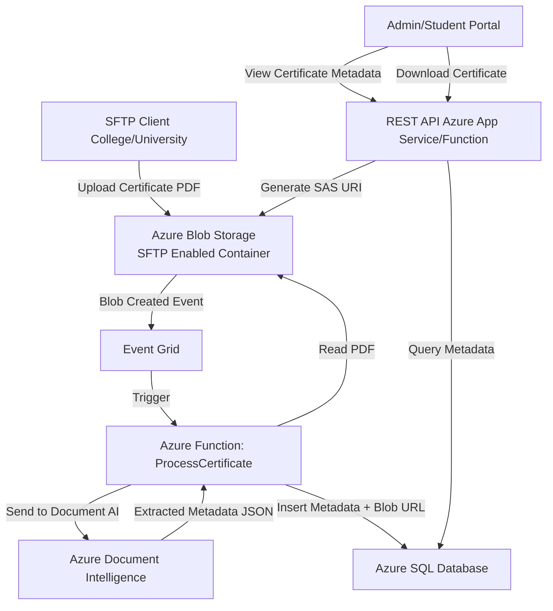
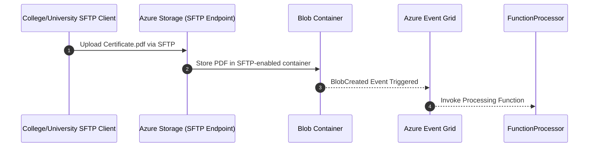
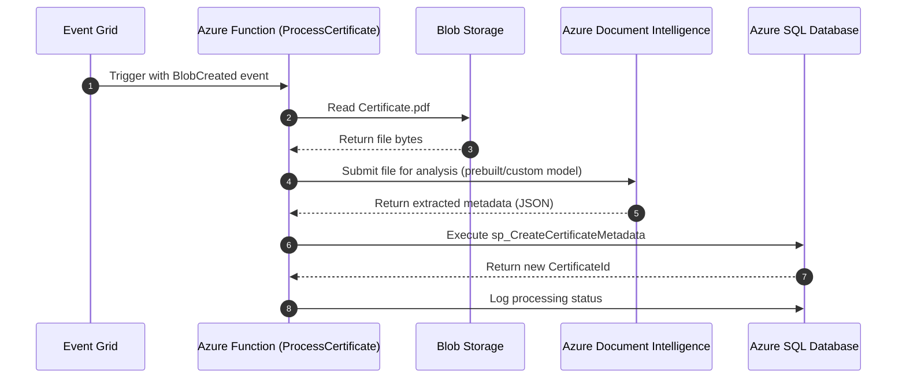
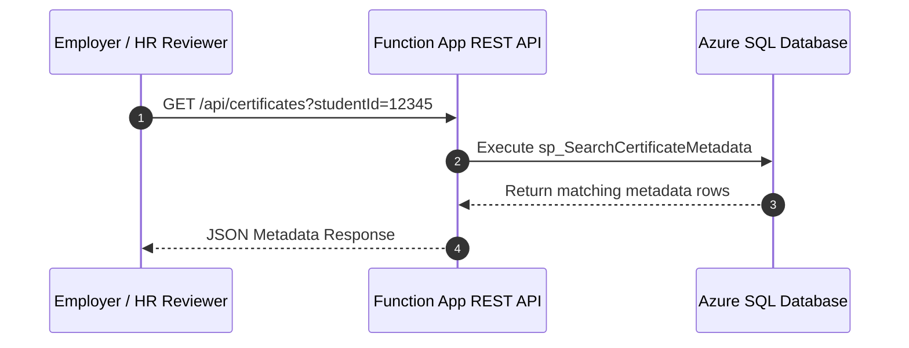
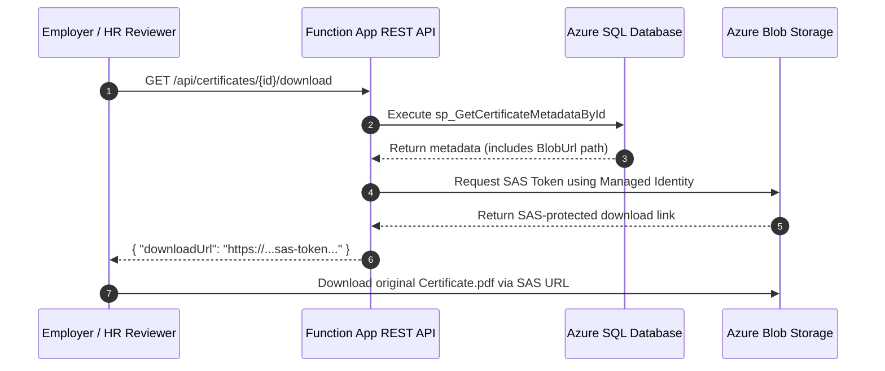
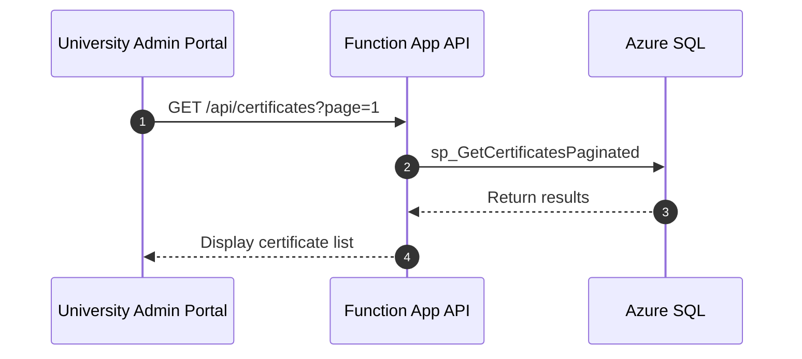
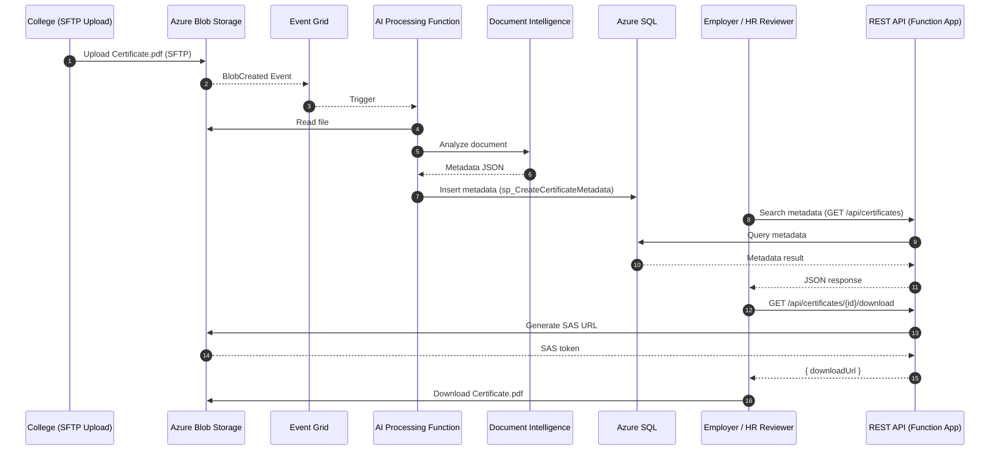

# Document-Upload-For-Universities


Below is a **detailed, implementation-ready use case** tailored to the workflow you requested, aligned with your Azure architecture style: serverless, event-driven, scalable, and integrated with Azure Document Intelligence + SQL + REST API.

---

# 🎓 **Use Case: Certificate Verification & Metadata Extraction for Colleges/Universities**

## **Business Problem**

Employers need a secure, automated method for verifying student academic certificates (transcripts, diplomas, vocational certificates). Many institutions still store documens as files in storage, creating bottlenecks during an employee verification check..

The university wants to **automate certificate ingestion, scanning, metadata extraction, verification, and storage**, allowing administrators and students to view certificate metadata and the original document through a secure REST API, plus the added benefits for employers

---

# 🚀 **End-to-End Workflow Summary**

1. **Colleges generate & upload certificate PDFs** via SFTP.
2. **Files automatically land in Azure Blob Storage** (SFTP-enabled container).
3. **Azure Event Grid** detects new uploads and triggers downstream processing.
4. **Azure Function (Document Processing Function)** runs asynchronously:

   * Pulls the PDF document from Blob Storage
   * Sends it to Azure Document Intelligence (Document AI)
   * Extracts structured metadata (Name, DOB, GPA, Degree, Graduation Year, Issuing Department, etc.)
   * Stores extracted metadata + blob URL reference in **Azure SQL Database**
5. **RESTful API (via Azure App Service / Azure Functions)** enables:

   * Querying certificate metadata (by student ID, year, name, etc.)
   * Viewing or downloading the original document from Blob Storage (Managed Identity + SAS)
6. Optional: **Power BI dashboard** for certificate verification analytics.

---

# 🧭 **Detailed Use Case Scenario**

A university receives thousands of academic certificates annually from partner colleges. Certificates arrive in PDF format with variations in layout, structure, and quality. Each must be:

* **Authenticated**
* **Parsed**
* **Indexed**
* **Stored for future retrieval**

Instead of building manual intake workflows, the university deploys the following automated solution using Azure.

---

# 🧩 **Azure Architecture Components**

| Layer      | Azure Service                        | Purpose                                                     |
| ---------- | ------------------------------------ | ----------------------------------------------------------- |
| Ingestion  | **SFTP-enabled Azure Blob Storage**  | Colleges upload PDFs securely using SFTP credentials        |
| Eventing   | **Event Grid**                       | Detects file uploads and triggers processing                |
| Processing | **Azure Functions**                  | Runs Document Intelligence, extracts metadata, saves to SQL |
| AI         | **Azure Document Intelligence**      | OCR + key-value pair extraction                             |
| Storage    | **Azure Blob Storage**               | Holds original certificate files                            |
| Database   | **Azure SQL Database**               | Stores metadata, processing logs, verification status       |
| API        | **Azure App Service / Function API** | Presents metadata & document-access endpoints               |
| Security   | **Managed Identity, RBAC, SAS**      | Secure document access, restricted metadata retrieval       |

---

# 🌐 **Mermaid Architecture Diagram**



---

# 📄 **Metadata Extracted from Document Intelligence**

* StudentName
* DateOfBirth
* StudentID
* CertificateType
* Degree / Program
* GPA (optional)
* Issuing College
* GraduationDate
* TranscriptNumber
* DocumentConfidenceScore
* BlobStorageURL

---

# 🗃 **SQL Table Example**

```sql
CREATE TABLE CertificateMetadata (
    CertificateId INT IDENTITY PRIMARY KEY,
    StudentName NVARCHAR(200),
    StudentId NVARCHAR(100),
    DateOfBirth DATE,
    CertificateType NVARCHAR(100),
    DegreeProgram NVARCHAR(200),
    GPA NVARCHAR(20),
    IssuingUniversity NVARCHAR(200),
    GraduationDate DATE,
    BlobUrl NVARCHAR(MAX),
    ProcessedDate DATETIME DEFAULT GETDATE()
);
```

---

# ⚙️ **Azure Function – Processing Flow**

### **1. Trigger**

```json
{
  "eventType": "Microsoft.Storage.BlobCreated",
  "data": {
    "url": "<blob-url>",
    ...
  }
}
```

### **2. Function Steps**

1. Function retrieves blob using Managed Identity
2. Sends the PDF to Document Intelligence `prebuilt-document` or custom model
3. Receives structured JSON
4. Maps JSON fields → SQL data model
5. Inserts into SQL
6. Logs errors or AI exceptions

---

# 🔗 **REST API Endpoints**

### **1. GET: List Certificates**

`GET /api/certificates?studentId=12345`

### **2. GET: Certificate by ID**

`GET /api/certificates/{certificateId}`

### **Response:**

```json
{
  "certificateId": 101,
  "studentName": "Jane Doe",
  "degreeProgram": "Computer Science",
  "graduationDate": "2023-06-15",
  "blobUrl": "<SAS URL>",
  "confidenceScore": 0.98
}
```

### **3. GET: Download Certificate**

`GET /api/certificates/{certificateId}/download`

* API returns a **short-lived SAS token**
* Client downloads directly from Blob Storage

---

Below is a **complete, production-ready set of SQL Server stored procedures** for full **CRUD metadata operations** for the `CertificateMetadata` table used in the university certificate ingestion workflow.

These procedures follow clean naming conventions, include validation, and are optimized for Azure SQL.
They are ready to be used by your **REST API**, **Azure Function**, or **admin portal**.

---

# 📘 **Table Reference**

```sql
CREATE TABLE CertificateMetadata (
    CertificateId INT IDENTITY PRIMARY KEY,
    StudentName NVARCHAR(200),
    StudentId NVARCHAR(100),
    DateOfBirth DATE,
    CertificateType NVARCHAR(100),
    DegreeProgram NVARCHAR(200),
    GPA NVARCHAR(20),
    IssuingUniversity NVARCHAR(200),
    GraduationDate DATE,
    BlobUrl NVARCHAR(MAX),
    ConfidenceScore FLOAT NULL,
    ProcessedDate DATETIME DEFAULT GETDATE()
);
```

---

# 🟦 **1. CREATE (Insert) Certificate Metadata**

```sql
CREATE OR ALTER PROCEDURE sp_CreateCertificateMetadata
(
    @StudentName NVARCHAR(200),
    @StudentId NVARCHAR(100),
    @DateOfBirth DATE = NULL,
    @CertificateType NVARCHAR(100),
    @DegreeProgram NVARCHAR(200) = NULL,
    @GPA NVARCHAR(20) = NULL,
    @IssuingUniversity NVARCHAR(200),
    @GraduationDate DATE = NULL,
    @BlobUrl NVARCHAR(MAX),
    @ConfidenceScore FLOAT = NULL,
    @NewCertificateId INT OUTPUT
)
AS
BEGIN
    SET NOCOUNT ON;

    INSERT INTO CertificateMetadata
    (
        StudentName, StudentId, DateOfBirth, CertificateType,
        DegreeProgram, GPA, IssuingUniversity, GraduationDate,
        BlobUrl, ConfidenceScore
    )
    VALUES
    (
        @StudentName, @StudentId, @DateOfBirth, @CertificateType,
        @DegreeProgram, @GPA, @IssuingUniversity, @GraduationDate,
        @BlobUrl, @ConfidenceScore
    );

    SET @NewCertificateId = SCOPE_IDENTITY();
END;
GO
```

---

# 🟩 **2. READ (Get by CertificateId)**

```sql
CREATE OR ALTER PROCEDURE sp_GetCertificateMetadataById
(
    @CertificateId INT
)
AS
BEGIN
    SET NOCOUNT ON;

    SELECT *
    FROM CertificateMetadata
    WHERE CertificateId = @CertificateId;
END;
GO
```

---

# 🟨 **3. READ (Search / Filter)**

Supports API queries such as:

* Search by Student ID
* Filter by Year
* Filter by Certificate Type

```sql
CREATE OR ALTER PROCEDURE sp_SearchCertificateMetadata
(
    @StudentId NVARCHAR(100) = NULL,
    @StudentName NVARCHAR(200) = NULL,
    @CertificateType NVARCHAR(100) = NULL,
    @GraduationYear INT = NULL
)
AS
BEGIN
    SET NOCOUNT ON;

    SELECT *
    FROM CertificateMetadata
    WHERE
        (@StudentId IS NULL OR StudentId = @StudentId)
        AND (@StudentName IS NULL OR StudentName LIKE '%' + @StudentName + '%')
        AND (@CertificateType IS NULL OR CertificateType = @CertificateType)
        AND (@GraduationYear IS NULL OR YEAR(GraduationDate) = @GraduationYear)
    ORDER BY ProcessedDate DESC;
END;
GO
```

---

# 🟧 **4. UPDATE Certificate Metadata**

```sql
CREATE OR ALTER PROCEDURE sp_UpdateCertificateMetadata
(
    @CertificateId INT,
    @StudentName NVARCHAR(200),
    @StudentId NVARCHAR(100),
    @DateOfBirth DATE = NULL,
    @CertificateType NVARCHAR(100),
    @DegreeProgram NVARCHAR(200) = NULL,
    @GPA NVARCHAR(20) = NULL,
    @IssuingUniversity NVARCHAR(200),
    @GraduationDate DATE = NULL,
    @BlobUrl NVARCHAR(MAX),
    @ConfidenceScore FLOAT = NULL
)
AS
BEGIN
    SET NOCOUNT ON;

    UPDATE CertificateMetadata
    SET
        StudentName = @StudentName,
        StudentId = @StudentId,
        DateOfBirth = @DateOfBirth,
        CertificateType = @CertificateType,
        DegreeProgram = @DegreeProgram,
        GPA = @GPA,
        IssuingUniversity = @IssuingUniversity,
        GraduationDate = @GraduationDate,
        BlobUrl = @BlobUrl,
        ConfidenceScore = @ConfidenceScore
    WHERE CertificateId = @CertificateId;
END;
GO
```

---

# 🟥 **5. DELETE Certificate Metadata**

```sql
CREATE OR ALTER PROCEDURE sp_DeleteCertificateMetadata
(
    @CertificateId INT
)
AS
BEGIN
    SET NOCOUNT ON;

    DELETE FROM CertificateMetadata
    WHERE CertificateId = @CertificateId;
END;
GO
```

---

# 🔵 **6. GET ALL Certificates (Paginated – API-Ready)**

Supports large datasets and API pagination.

```sql
CREATE OR ALTER PROCEDURE sp_GetCertificatesPaginated
(
    @PageNumber INT = 1,
    @PageSize INT = 25
)
AS
BEGIN
    SET NOCOUNT ON;

    DECLARE @Offset INT = (@PageNumber - 1) * @PageSize;

    SELECT *
    FROM CertificateMetadata
    ORDER BY ProcessedDate DESC
    OFFSET @Offset ROWS
    FETCH NEXT @PageSize ROWS ONLY;
END;
GO
```

---

# 🧪 **7. Logging Procedure (Optional)**

Useful when combined with Azure Functions or Document AI.

```sql
CREATE TABLE CertificateProcessingLog (
    LogId INT IDENTITY PRIMARY KEY,
    CertificateId INT NULL,
    LogMessage NVARCHAR(MAX),
    LogDate DATETIME DEFAULT GETDATE()
);
GO

CREATE OR ALTER PROCEDURE sp_LogCertificateProcessing
(
    @CertificateId INT = NULL,
    @LogMessage NVARCHAR(MAX)
)
AS
BEGIN
    INSERT INTO CertificateProcessingLog (CertificateId, LogMessage)
    VALUES (@CertificateId, @LogMessage);
END;
GO
```
Below are **production-quality sequence diagrams** for each subsystem—covering **Ingestion**, **AI Processing**, **Metadata Storage**, and **Employer Access**—including the workflow where an **employer retrieves metadata and downloads the scanned certificate** through a **Function App REST API**.

All diagrams follow a consistent Azure architecture and reflect the stored procedures you requested earlier.

---

# 🟦 **1. Sequence Diagram – Certificate Upload & Ingestion (SFTP → Azure Blob Storage → Event Grid)**



---

# 🟩 **2. Sequence Diagram – Document Processing Pipeline (Function → Document Intelligence → SQL)**



---

# 🟨 **3. Sequence Diagram – Metadata Retrieval API (Employer Searches Certificate Metadata)**

This diagram shows **an employer querying metadata** via the REST API exposed from an **Azure Function App** or **App Service API**.



**JSON example returned:**

```json
{
  "certificateId": 101,
  "studentName": "Jane Doe",
  "degreeProgram": "Computer Science",
  "graduationDate": "2023-06-15",
  "hasDocument": true
}
```

---

# 🟥 **4. Sequence Diagram – Employer Accessing the Original Certificate via REST API (SAS Token Flow)**

This includes generating a **secure, short-lived SAS URL** using the Function App’s **Managed Identity**, ensuring no document is exposed directly.



---

# 🟦 **5. Sequence Diagram – Admin Portal (Optional UI Flow)**

This illustrates how an **internal admissions or registrar admin** may use the portal.



---

# 🔵 **6. End-to-End Workflow – All Subsystems Together (Condensed Overview)**



---
